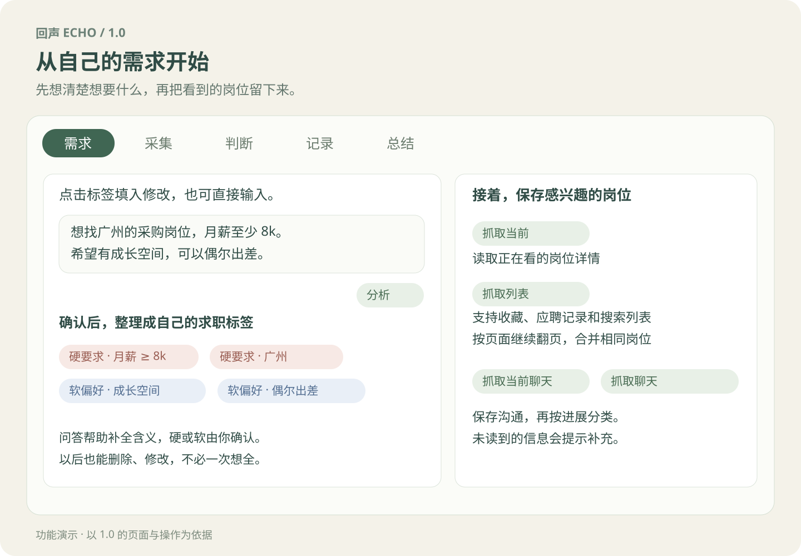
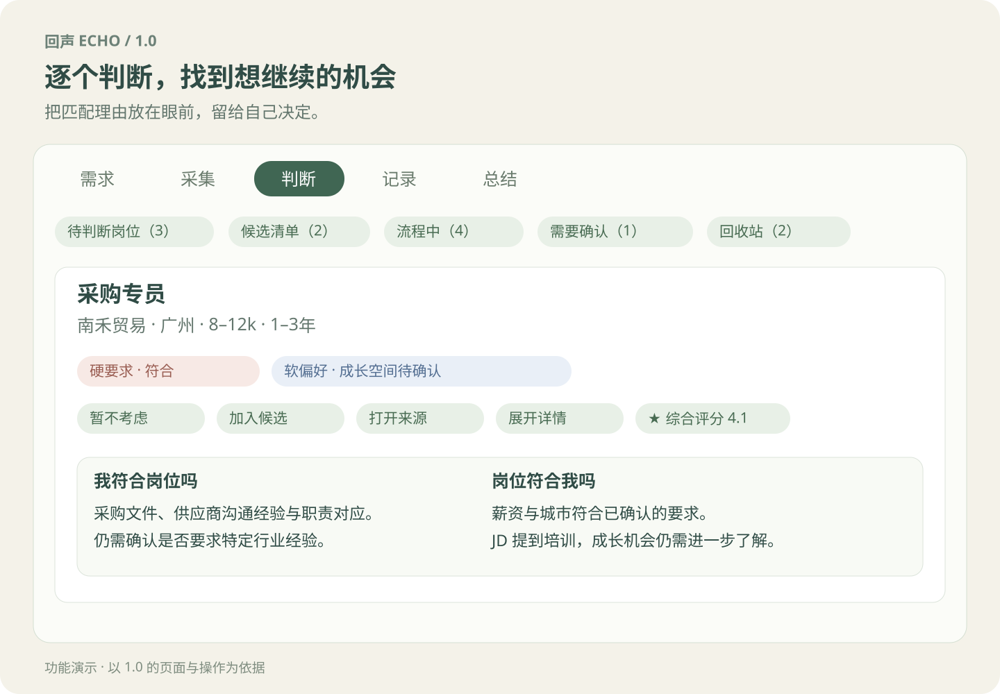
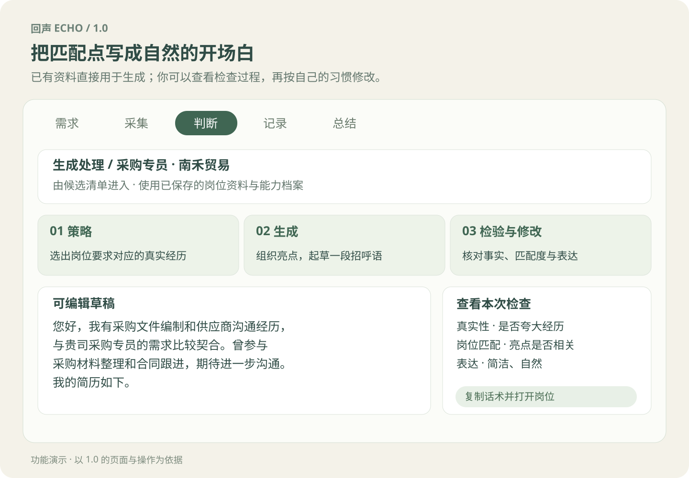
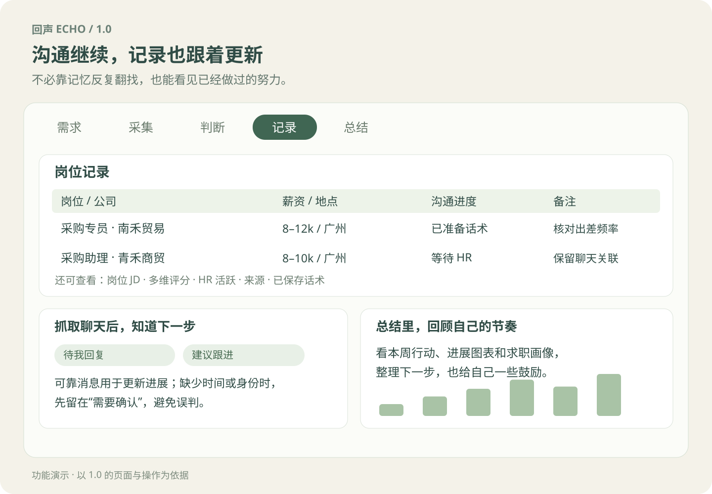

# 回声 Echo · AI 求职助手

**整理求职进展，准备下一次沟通。**

收藏了很多岗位，却想不起哪一个聊过、哪一个还值得跟进？Echo 帮你把岗位、沟通和自己的想法放在一起，也帮你从真实经历中准备一段更贴合岗位的自我介绍。

适用于电脑端猎聘，支持 Chrome / Edge，无需注册 Echo 账号。

[下载安装包](https://github.com/Selina-Meng/echo-job-assistant/releases/download/v1.0.0/echo-ai-job-assistant-v1.0.0.zip) · [版本说明](https://github.com/Selina-Meng/echo-job-assistant/releases/tag/v1.0.0)

## 求职时，少一些来回整理

| 你想做的事 | Echo 能提供的帮助 |
|---|---|
| 留住值得考虑的机会 | 保存收藏、搜索到的岗位和沟通进展，再次看到同一岗位时找回之前的备注 |
| 想清楚要不要投 | 对照你的经历和求职要求，看优势、差距，以及还需要问清楚的事 |
| 写一段合适的开场白 | 从你的真实经历中找出相关亮点，起草招呼语，供你修改后使用 |
| 接着上次的话聊 | 整理聊天进展，提醒哪些需要回复、哪些还在等待 |
| 看见已经做过的努力 | 用记录、图表和总结回顾进展，安排接下来想做的事 |

## 开始使用

### 1. 安装 Echo

1. 下载上方安装包，完整解压到一个固定文件夹。
2. 在浏览器地址栏输入：Chrome 用 chrome://extensions，Edge 用 edge://extensions。
3. 开启“开发者模式”，点击“加载已解压的扩展程序”。
4. 选择包含 manifest.json 的文件夹，再从浏览器扩展菜单打开“回声 Echo”。

目前采用手动安装。以后升级时先导出备份，再覆盖原文件夹并重新加载扩展，避免卸载导致数据丢失。

### 2. 完成初次设置

打开后跟随引导：**欢迎 → API Key → 数据授权 → 能力档案 → 求职目标 → 第一个岗位 → 第一条招呼语**。

| 设置 | 怎么填写 |
|---|---|
| DeepSeek API Key | 在 [DeepSeek 平台](https://platform.deepseek.com/api_keys) 创建后填入。它用于调用 AI，费用由 DeepSeek 按用量收取 |
| 数据授权 | 阅读说明后选择是否同意将必要的岗位、档案或聊天内容交给 DeepSeek 分析 |
| 能力档案 | 写下做过的工作、负责的事情、技能和成果，越具体越有助于找到岗位匹配点 |
| 求职目标 | 像聊天一样写下想法，再回答选择题，确认哪些是硬要求、哪些是软偏好；也可以稍后再填 |

暂时不使用 AI，可以选择“暂用本地功能”，先保存岗位、查看记录和手动编辑。所有配置都能在设置页修改，也可以重新体验新手引导。

### 3. 保存一个岗位，试着准备沟通

1. 登录猎聘，打开感兴趣的岗位详情，在 Echo 的“采集”页抓取当前岗位。
2. 到“判断”查看岗位资料和匹配说明，感兴趣就加入候选。
3. 为候选岗位准备话术，核对并修改草稿，再复制到猎聘使用。
4. 有了聊天后，抓取会话，在“记录”查看进展，在“总结”回顾这一轮求职。

是否投递、是否发送，都由你决定；复制话术不会自动标为已投递。

## 招呼语是怎么写出来的？

Echo 先找出岗位要求与你的经历之间的联系，再起草招呼语，检查有没有夸大经历、偏离岗位或表达生硬的地方，必要时修改。你可以查看检查结果，并保留自己的表达方式。

我也使用相同的脱敏资料与模型进行盲评：隐藏版本后评价真实性、岗位匹配和表达自然度，再回看策略、初稿、检验与修订，定位需要改进的步骤。[查看测试过程与下一步计划](CASE-STUDY.md)。

## 功能与日常用法

### 需求：把想法变成可修改的标签

在输入框写下想法，点击“分析”，回答弹窗里的选择题，同时确认哪些是硬要求、哪些是软偏好。核对并保存后才生效。

- **硬要求**：你认为不能妥协的条件，例如最低薪资、工作城市。发现冲突时，卡片会明确提醒，由你决定处理方式。
- **软偏好**：你希望满足、但愿意进一步了解的条件，例如成长空间、出差频率。依据不足时会说明需要确认。
- **判断反馈**：暂不考虑岗位时，可以填写原因并勾选加入下次问答。点击反馈标签可填入分析框，重新整理需求；一次放弃不会擅自改掉全部筛选条件。

标签可以修改或删除。没有提供证据的信息会保留为未知；AI 的初步推断会与明确依据区分。

### 采集：读取你已打开的网页

Echo 通过浏览器读取页面中可访问的岗位和聊天内容；需要你先登录猎聘、打开对应页面。

| 按钮 | 先打开什么 | 会做什么 |
|---|---|---|
| 抓取当前 | 岗位详情页 | 读取主岗位名称、公司、JD、薪资、地点等，保存为记录 |
| 抓取列表 | 收藏、应聘记录或搜索结果页 | 找到列表内岗位，逐个读取详情并继续翻页；保留搜索筛选条件 |
| 抓取当前聊天 | 一条具体会话 | 只读取当前会话，尝试关联已有岗位，分析消息与进展 |
| 抓取聊天 | 猎聘聊天列表 | 分批读取会话，每批最多 21 条，继续时从保存的位置接着处理 |
| ↻ / ■ | 有可恢复或正在运行的任务 | 重试或继续；在当前步骤保存后结束任务 |

列表扫描一轮最多三页、100 个唯一岗位，达到范围后可继续。结果会说明实际处理范围，不代表扫描了账号内所有岗位。页面加载、登录或结构变化可能影响读取；失败项可以单独重试，必要时粘贴链接补充。

相同平台岗位编号或规范化链接用于识别同一岗位，合并来源并更新资料；只是名称相同，不会直接合并。职位更新时间、HR 活跃信息和详细地址仅在页面能读到时保存，不把缺失信息当成事实。

### 判断：按眼前要处理的事分类

上方切换类别，既可以逐张看，也可以切换批量列表。处理完一张后留在当前类别，继续完成这一类事情。

| 卡片类别 | 为什么出现在这里 | 你可以怎样处理 |
|---|---|---|
| 待判断岗位 | 已保存、尚未做出选择的岗位 | 查看匹配，加入候选、暂时跳过或暂不考虑 |
| 候选清单 | 你已经表达兴趣，尚待继续处理 | 单个或勾选批量准备话术，也可以暂不考虑 |
| 暂时跳过 | 目前还不想决定 | 回到待判断、加入候选，或暂不考虑 |
| 流程中 | 已准备话术，或已有投递、沟通等进展 | 查看详情、写备注、更新进度，必要时处理条件冲突 |
| 待我回复 | 可靠消息表明当前轮到你回复 | 打开沟通、准备草稿，核对后自行发送 |
| 建议跟进 | 已有沟通，满足等待时长等跟进条件 | 查看依据，再决定是否跟进；不是所有未回复都会催促 |
| 需要确认 | 岗位资料、聊天关联、消息身份或时间缺失，或有回收建议待处理 | 补充信息、关联岗位，或确认回收；符合条件的会话可批量分析归类 |
| 本次失败 | 本轮某个读取、分析或保存步骤失败 | 查看具体岗位与原因，单条重试或忽略；可批量忽略失败项 |
| 回收站 | 主动放弃，或按规则处理的超时、拒绝事项 | 查看原因或恢复；主动放弃的岗位有 24 小时撤回期 |
| 疑似同名岗位 | 名称相近，但不能确认是同一岗位 | 对比资料、打开来源、忽略提醒，或删除这次抓取记录 |
| 更新求职需求 | 有你勾选过的判断反馈等待整理 | 现在更新或稍后，确认新标签后才改变需求 |

这些类别是处理视图，同一岗位的沟通待办也可能出现在行动类别里，底层仍关联同一份岗位记录。等待 HR 的状态放在“流程中”，不再另设“等待中”类别。

主动放弃的岗位，24 小时后会清除详细资料，仅保留岗位名称、公司、薪资和唯一编码用于重复识别；历史备份不受影响。聊天归档按其回收原因保存和恢复，不等同于这一条清理规则。

### 匹配和评分：帮助比较，保留判断空间

| 看什么 | 回答的问题 |
|---|---|
| 原有多维评分 | 从岗位、能力、薪资、地点、公司和成长等维度看机会，点击星标查看分项理由 |
| 我符合岗位吗 | 你的经历与岗位职责、任职要求有哪些对应，哪些还有缺口 |
| 岗位符合我吗 | 岗位是否符合已经确认的硬要求与软偏好，依据是否足够 |

评分与双向匹配分别展示。AI 分析需要 Key 和授权；资料不足、调用失败或结果过期时会说明原因，可单项重试。不会用零分代替未知，也不会因反复打开页面就重新调用模型。

### 生成：先匹配，再起草和检查

从候选清单或记录进入生成处理页，使用已经保存的岗位和个人档案，不必再打开岗位重新抓取。可以单个生成，也可以按队列批量处理。

1. **策略**：选出最多三个与岗位有关的经历亮点。
2. **生成**：写成一段简短、自然的招呼语。
3. **检验**：检查真实性、岗位匹配、个性化、简洁度与自然度，必要时修改。
4. **你来使用**：编辑草稿，再复制并打开岗位；保存的是你当前编辑的版本。

生成话术会写回原岗位，表示“已准备话术”，不等于已经投递。失败时查看提示，已有可用草稿可保留；不要把模型检查当成事实保证。

### 聊天、记录与总结：接着上次继续

聊天读取会区分双方消息和系统提示，提取能确认的消息时间，尝试关联已有岗位；没有新消息时复用分析，不推进沟通时间。缺少岗位的聊天可以先保留，等待关联，不强行创建空白岗位。

“查看沟通”里可打开原聊天、补充缺失信息或准备回复。跟进和回收依据消息、等待对象及可靠时间判断：仅有自己打招呼且满 48 小时未获招聘方回复，可进入回收判断；已有往来则使用后续等待规则。时间或身份不清楚时先确认，不因读取失败就判定拒绝。

| 记录里有什么 | 用途 |
|---|---|
| 岗位名称、公司、地点、薪资、规模、来源 | 找回同一个机会，打开原岗位 |
| JD、可读取的 HR 活跃与岗位更新时间 | 核对岗位内容和信息新旧；部分字段在详情查看 |
| 用户判断、沟通状态、岗位可用性 | 区分“我不考虑”“等待 HR”和“岗位停止招聘”，避免混为一谈 |
| 综合评分、双向匹配与依据 | 比较机会，了解判断来自哪里 |
| 备注、已保存话术、关联聊天与处理历史 | 接着上次继续，保留自己的想法和实际进展 |

记录表支持筛选、排序与批量操作。总结保留行动建议、统计图表、趋势对比、求职画像、鼓励文案和历史总结，帮助回顾这一段时间，而不只盯着有没有回复。

## 常见问题

| 遇到的情况 | 处理方法 |
|---|---|
| 想重新看一遍引导 | 设置 → 重新体验新手引导，不会删除已有记录 |
| 不能使用 AI | 到设置检查 Key 和数据授权，再查看具体错误提示 |
| 岗位没有读取成功 | 确认已登录猎聘并打开详情页，按提示重新读取或补充资料 |
| 聊天出现在“需要确认” | 按提示补充联系人、岗位、发言方或时间，确认后继续处理 |
| 分析或生成失败 | 保留已有草稿，检查错误原因后重试 |
| 要升级、换电脑或浏览器 | 先在设置导出备份，到新环境再恢复；妥善保管包含个人资料的备份文件 |

## 数据与使用范围

资料默认保存在本地浏览器。使用 AI 前需要你的授权，分析所需的岗位、档案或聊天内容会发送给 DeepSeek，API Key 用于请求验证。OCR 另需百度授权；可选的本机同步服务不包含在安装包内。[隐私说明](PRIVACY.md)。

目前主要支持猎聘电脑网页。网站改版或信息缺失时，部分内容需要手动补充；外部联网补充资料暂未开放。AI 生成的内容使用前仍需核对。

## 项目与许可

这是我从自己的求职需要出发，持续与 AI 协作开发的项目。我负责产品设计、提示词、测试与使用验收。

原创程序采用 [PolyForm Noncommercial 1.0.0](LICENSE)，原创文档与视觉采用 CC BY-NC 4.0；使用和分享时请保留[来源署名](NOTICE)，商业使用不在授权范围内。动森风格来自 guokaigdg 的 Animal Island UI，详见[第三方许可](THIRD-PARTY-NOTICES.md)。

[迭代与评测](CASE-STUDY.md) · [验收记录](ACCEPTANCE.md) · [开发说明](DEVELOPMENT.md)
