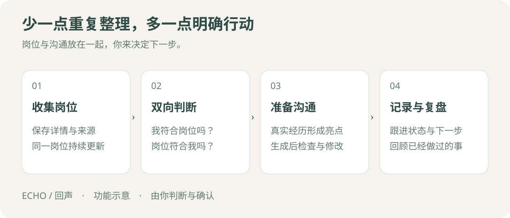
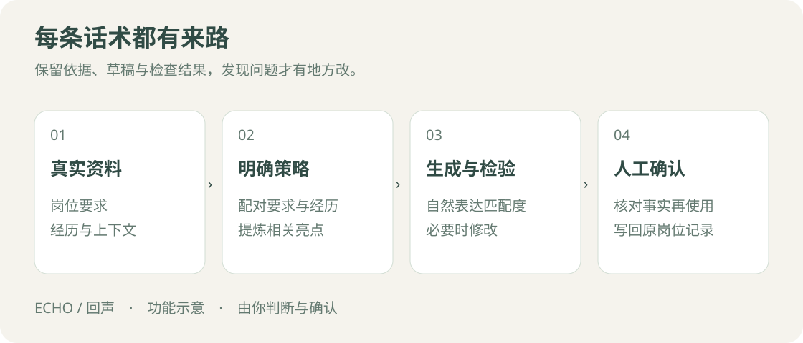

# 回声 Echo · AI 求职助手

**整理求职进展，准备下一次沟通。**

收藏了很多岗位，却想不起哪一个聊过、哪一个还值得跟进？Echo 帮你把岗位、沟通和自己的想法放在一起，也帮你从真实经历中准备一段更贴合岗位的自我介绍。

适用于电脑端猎聘，支持 Chrome / Edge，无需注册 Echo 账号。

[下载安装包](https://github.com/Selina-Meng/echo-job-assistant/releases/download/v1.0.0/echo-ai-job-assistant-v1.0.0.zip) · [版本说明](https://github.com/Selina-Meng/echo-job-assistant/releases/tag/v1.0.0)

## 求职时，少一些来回整理

| 你想做的事 | Echo 能提供的帮助 |
|---|---|
| 留住值得考虑的机会 | 保存收藏、搜索到的岗位和沟通进展，再次看到同一岗位时找回之前的备注 |
| 想清楚要不要投 | 对照你的经历和求职要求，看优势、差距，以及还需要问清楚的事 |
| 写一段合适的开场白 | 从你的真实经历中找出相关亮点，起草招呼语，供你修改后使用 |
| 接着上次的话聊 | 整理聊天进展，提醒哪些需要回复、哪些还在等待 |
| 看见已经做过的努力 | 用记录、图表和总结回顾进展，安排接下来想做的事 |

## 开始使用

### 1. 安装 Echo

1. 下载上方安装包，完整解压到一个固定文件夹。
2. 在浏览器地址栏输入：Chrome 用 chrome://extensions，Edge 用 edge://extensions。
3. 开启“开发者模式”，点击“加载已解压的扩展程序”。
4. 选择包含 manifest.json 的文件夹，再从浏览器扩展菜单打开“回声 Echo”。

目前采用手动安装。以后升级时先导出备份，再覆盖原文件夹并重新加载扩展，避免卸载导致数据丢失。

### 2. 完成初次设置

打开后跟随引导：**欢迎 → API Key → 数据授权 → 能力档案 → 求职目标 → 第一个岗位 → 第一条招呼语**。

| 设置 | 怎么填写 |
|---|---|
| DeepSeek API Key | 在 [DeepSeek 平台](https://platform.deepseek.com/api_keys) 创建后填入。它用于调用 AI，费用由 DeepSeek 按用量收取 |
| 数据授权 | 阅读说明后选择是否同意将必要的岗位、档案或聊天内容交给 DeepSeek 分析 |
| 能力档案 | 写下做过的工作、负责的事情、技能和成果，越具体越有助于找到岗位匹配点 |
| 求职目标 | 像聊天一样写下想法，再回答选择题，确认哪些是硬要求、哪些是软偏好；也可以稍后再填 |

暂时不使用 AI，可以选择“暂用本地功能”，先保存岗位、查看记录和手动编辑。所有配置都能在设置页修改，也可以重新体验新手引导。

### 3. 保存一个岗位，试着准备沟通

1. 登录猎聘，打开感兴趣的岗位详情，在 Echo 的“采集”页抓取当前岗位。
2. 到“判断”查看岗位资料和匹配说明，感兴趣就加入候选。
3. 为候选岗位准备话术，核对并修改草稿，再复制到猎聘使用。
4. 有了聊天后，抓取会话，在“记录”查看进展，在“总结”回顾这一轮求职。

是否投递、是否发送，都由你决定；复制话术不会自动标为已投递。

## 招呼语是怎么写出来的？

Echo 先找出岗位要求与你的经历之间的联系，再起草招呼语，检查有没有夸大经历、偏离岗位或表达生硬的地方，必要时修改。你可以查看检查结果，并保留自己的表达方式。

我也做过盲评比较：增加步骤并没有让每段话都更好。这些结果帮助我继续调整取材和检查方式。[查看测试结果与下一步计划](CASE-STUDY.md)。

## 常见问题

| 遇到的情况 | 处理方法 |
|---|---|
| 想重新看一遍引导 | 设置 → 重新体验新手引导，不会删除已有记录 |
| 不能使用 AI | 到设置检查 Key 和数据授权，再查看具体错误提示 |
| 岗位没有读取成功 | 确认已登录猎聘并打开详情页，按提示重新读取或补充资料 |
| 聊天出现在“需要确认” | 按提示补充联系人、岗位、发言方或时间，确认后继续处理 |
| 分析或生成失败 | 保留已有草稿，检查错误原因后重试 |
| 要升级、换电脑或浏览器 | 先在设置导出备份，到新环境再恢复；妥善保管包含个人资料的备份文件 |

## 数据与使用范围

资料默认保存在本地浏览器。使用 AI 前需要你的授权，分析所需的岗位、档案或聊天内容会发送给 DeepSeek，API Key 用于请求验证。OCR 另需百度授权；可选的本机同步服务不包含在安装包内。[隐私说明](PRIVACY.md)。

目前主要支持猎聘电脑网页。网站改版或信息缺失时，部分内容需要手动补充；外部联网补充资料暂未开放。AI 生成的内容使用前仍需核对。

## 项目与许可

这是我从自己的求职需要出发，持续与 AI 协作开发的项目。我负责产品设计、提示词、测试与使用验收。

原创程序采用 [PolyForm Noncommercial 1.0.0](LICENSE)，原创文档与视觉采用 CC BY-NC 4.0；使用和分享时请保留[来源署名](NOTICE)，商业使用不在授权范围内。动森风格来自 guokaigdg 的 Animal Island UI，详见[第三方许可](THIRD-PARTY-NOTICES.md)。

[迭代与评测](CASE-STUDY.md) · [验收记录](ACCEPTANCE.md) · [开发说明](DEVELOPMENT.md)
